# 计算机网络

- ## HTTP

  **六类面试题**

  1. HTTP基本概念

     - ***HTTP是什么***

     ​	超文本传输协议 HyperText Transfer Protocol

     - **HTTP常见的状态码**

     


### 1xx 中间态，还需后续操作

### 2xx 成功

- **200 OK**
- **204 No Content** ---与200基本相同，响应没有body数据
- **206 Partial Content** --- **该响应并不是资源的全部，应用于HTTP分块下载或断点续传**

### 3xx 重定向，资源位置发生变动，需要重新请求

- **301 Moved Permanently** 永久重定向，说明资源已经不存在了，需要新的URL

- **302 Found** 临时重定向，说明请求的资源还在，但暂时需要新的URL访问

  #### **301和302都会在响应头里使用字段location，说明后续跳转的URL，浏览器会自动重新定向URL**

- **304 Not Modified** 不具有跳转的含义，表示可以使用缓存，缓存未过期

### 4xx 客户端错误，请求报文有误

- **400 Bad Request** ---客户请求的报文有误
- **403 Forbidden** --- 服务器禁止访问资源，并不是客户端的请求出错
- **404 Not Found** --- 请求的资源在服务器上找不到

### 5xx 服务器错误，服务器在处理请求时内部发生错误

- **500 Internal Server Error** --- 服务器错误，笼统
- **501 Not Implemented** --- 客户端请求的功能服务器暂不支持
- **502 Bad Gateway** --- 表示服务器自身正常工作，但是后端服务器发生了错误
- **503 Service Unavaliable** --- 服务器繁忙，稍后再试

- **HTTP常见的字段**

HOST —— 网站名

```text
Host: www.A.com
```

Content-Length —— 数据长度

```text
Content-Length: 1000
```

Connection —— 长连接（Keep-Alive）

```text
Connection: Keep-Alive
```

Content-Type —— 返回数据格式

```text
Content-Type: text/html; Charset=utf-8
```

Content-Encoding —— 数据压缩方法

```text
Content-Encoding: gzip
```

1. Get与Post

   - **GET和POST有什么区别**

   *GET —— 从服务器获取资源*

   *POST —— 根据请求（body）对指定资源做出处理*

   - **GET和POST方法都是安全和幂等的吗**

   *GET是安全和幂等的，可以做缓存，POST会修改服务器资源，不安全，不幂等*

2. HTTP特性

   **优**

   - 简单

   - 应用广泛

   - 灵活可扩展---下层可以随意变化

     例如HTTPS就是在HTTP和TCP之间加了SSL/TLS安全传输层

     HTTP/1.1和HTTP/2.0传输协议使用的是TCP协议，而到了HTTP/3.0传输协议改用了UDP

   **缺**

   - 无状态

     网页之间不好关联，使用Cookie技术

   - 明文传输
   - 安全性

   **性能**

   - 长连接---一次连接，若没有提出断开，则保持连接。超过一定时长没有数据交互，断开连接。
   - 管道网络传输---发送一次请求之后，不用等响应，就可以发送第二次请求。**解决了请求的队头阻塞**
   - 队头阻塞 --- **对服务器来说，必须按顺序处理每次请求，会发生服务器的队头阻塞**

3. HTTP缓存技术

   - **有哪些实现方式？**

     *强制缓存 & 协商缓存*

   - **什么是强制缓存**

     *只要浏览器判断缓存没有过期，则直接使用缓存，主动权在浏览器*

     Cache-Control(优先级高)

     Expires

     第一次访问返回时，加上Cache-Control时间，下次访问先判断，没过期直接用。

   - **什么是协商缓存**

     *客户端与服务器协商决定*

     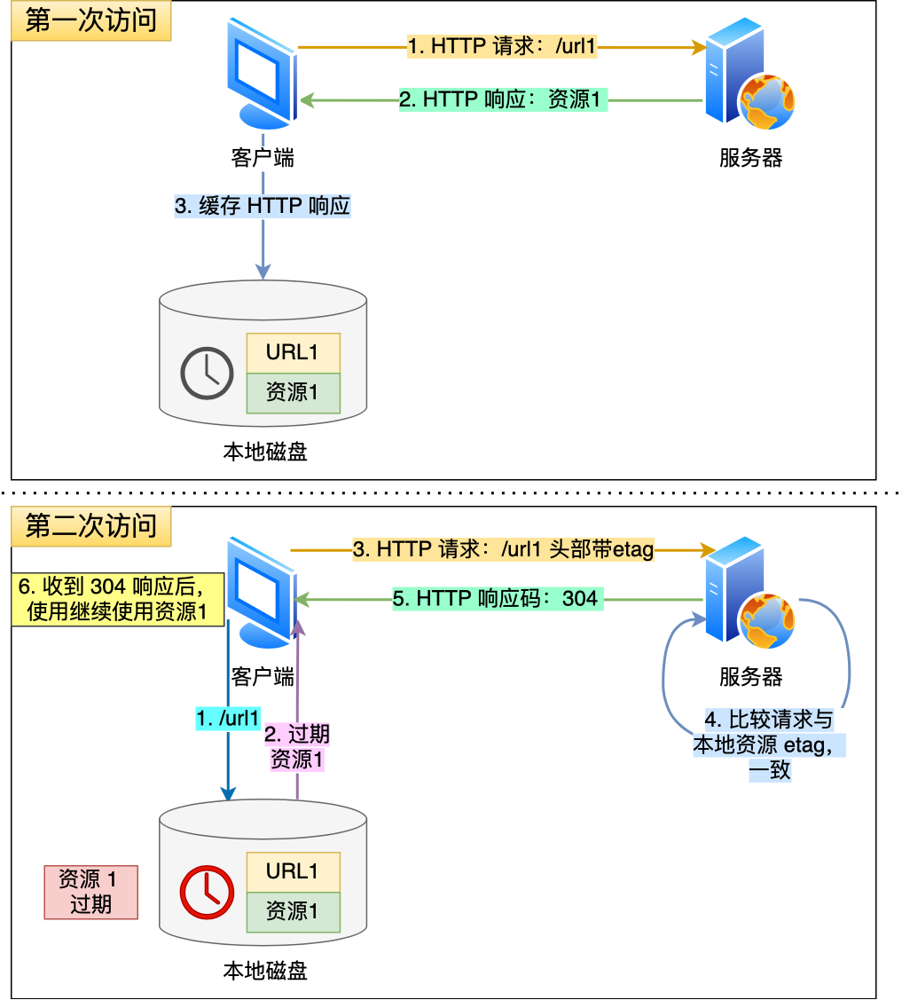

     - If-Modified-Since & Last-Modified

     响应头部Last-Modified
     
     请求头部If-Modified-Since
     
     资源过期，响应头部有Last-Modified, 再次请求时，带上Last-Modified时间，服务器收到请求时看是否有If-Modified-Since, 有的话对比时间，看返回304还是200.
     
     - If-None-Match & ETag
     
     资源过期，若发现响应里有Etag，再次请求时，把If-None-Match值设为Etag。看资源有无变化返回304或者200。
     
     **Etag方式更准确，可以避免由于时间篡改的风险，且Etag的优先级更高**
     
     - 没有修改文件内容的情况下，文件修改时间也会变
     - 有些文件是在秒级以内修改的，If-Modified-Since能检查的粒度是秒级的，Etag能保证客户端在这种需求下1s内刷新多次
     - 有些服务器不能精确获取文件最后修改时间

4. # HTTPS与HTTP

   **HTTP与HTTPS**

   - HTTPS在TCP和HTTP之间加入了SSL/TLS安全协议，使得报文能加密传输
   - 除TCP握手之外，还需要进行SSL/TLS的握手
   - 端口号80 443
   - HTTPS需要向CA申请数字证书

   **HTTPS解决了HTTP的什么问题**

   - 窃听风险---混合加密

     - 对称加密和非对称加密混合的算法

       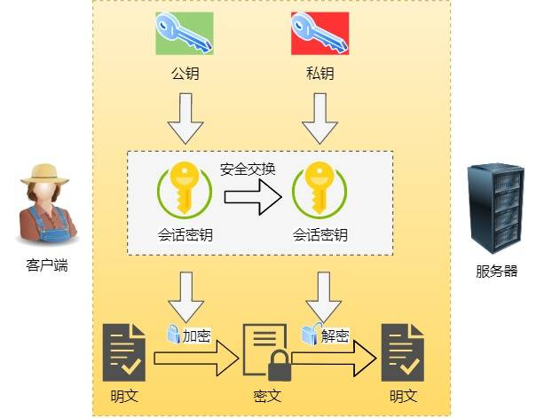

       # **不会，暂时不想看**

   - 篡改风险---摘要算法

     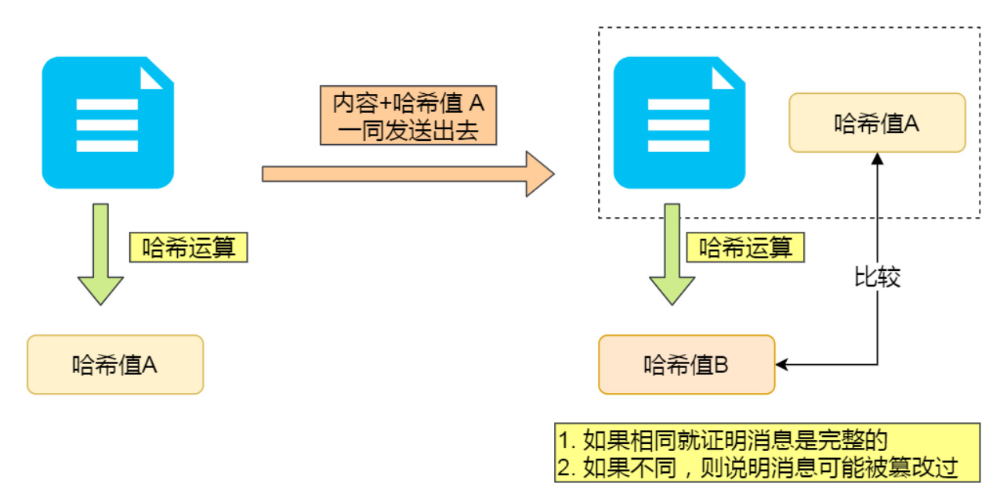

     **发送数据的时候根据内容计算出唯一的哈希值，对方收到后对该内容进行哈希运算，得出一个哈希值，进行比对**------无法解决内容和哈希一起被换的情况

     - ### **数字证书**，**保证消息来源的可靠性**

   - 冒充风险---服务器公钥放到数字证书中

   ## **HTTPS是如何建立连接的？**期间交互了什么？

   ### SSL/TLS协议基本流程

   - 客户端向服务器索要并验证服务器的公钥

   - 双方协商产生会话私钥

   - 双方采用会话私钥进行加密通信

     **前两步就是SSL/TLS的建立过程，也就是TLS握手阶段，涉及4次通信，使用不同的密钥交换算法。常见的密钥交换算法有两种，RSA算法和ECDHE算法**

     - 基于RSA算法的握手过程

       

### TLS协议建立的详细过程？

- #### ClientHello

  首先客户端向服务器发起加密通信请求，也就是ClientHello请求

  在这一步中，主要发送以下信息：

  - 客户端支持的TLS版本
  - 客户端生成的随机数，**后期用于生成会话密钥的条件之一**
  - 客户端支持的密码套件列表，如RSA加密算法

- ### ServerHello

  服务器收到客户端请求之后，向客户端发出请求，也就是ServerHello，内容如下：

  - 确认TLS版本，若浏览器不支持则关闭加密通信
  - 服务器产生的随机数（Server Random），**也是后面用于生产的会话密钥条件之一**
  - 确认密码套件列表，如RSA加密算法
  - 服务器的数字证书

- ### 客户端回应

  客户端收到服务器的回应之后，先通过浏览器或者操作系统的CA公钥，确认服务器的数字证书的真实性

  若没问题，则从数字证书中取出服务器的公钥，用它加密报文，向服务器发送如下信息：

  - 一个随机数（pre-master key）该随机数会被服务器公钥加密---**通信过程中第三个随机数，由于这个随机数客户端会发送给服务端，所以这个随机数客户端和服务端都是一样的**
  - 加密通信算法改变通知，表示随后的信息都用会话密钥加密通信
  - 客户端握手结束通知，并将之前所有内容的发生数据做个摘要，用来供服务端校验

  **服务器和客户端有了这三个随机数（Client Random，Server Random， pre-master key），接着用双方协商的加密算法，各自生成本次通信的密钥**

- ### 服务器的最后回应

  服务器收到客户端的第三个随机数（pre-master key）之后，通过协商的加密算法，计算出本次通信的会话密钥，然后，向客户端发送最后信息：

  - 加密通信算法改变通知，表示之后的通信都用会话密钥加密通信
  - 服务器握手结束通知，对之前数据作摘要，供客户端验证。

**至此，整个TLS握手阶段全部结束。接下来，客户端和服务端进入加密通信，完全使用普通的HTTP协议，只不过用会话密钥加密内容**

## 数字证书

## HTTP/1.1、HTTP/2、HTTP/3演变

- **HTTP/1.1相比于HTTP/1.0提高了什么性能**
  - 长连接，改善了性能开销
  - 支持管道传输，可以减少整体响应时间
  - 但是也有缺点
    - 请求/响应header未经压缩就发送，只压缩了body，首部信息越多延迟就越大
    - 发送冗长的首部，每次发送相同首部，浪费资源
    - 服务器按照请求顺序处理，会发生队头阻塞
    - 没有请求优先控制级
    - 只能从客户端开始，服务器只能被动响应

- **HTTP/2做了什么优化**

  

  - HTTP/2是基于HTTPS的，安全性能有保障

  - 头部压缩了

    - 如果同时发送多个请求，他们的头部相似或者相同，那么HTTP/2会消除相同部分

      ​	这就是**HPACK算法**：在客户端和服务器同时维护一张头信息表，所有字段都存入这个表，生成一个索引号，以后就不发送相同字段了，只发送索引号，**提速**

  - 二进制格式

    - 不再像HTTP/1.1的纯文本形式的报文，**而是全面采用了二进制格式**，头信息和数据体都是二进制，**并且统称为帧（Frame）**：**头信息帧（Headers Frame）和数据帧（Data Frame）**

      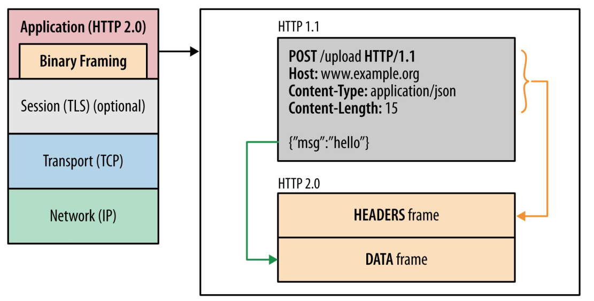

      **增加了数据的传输效率**

  - 并发传输————**多个Stream复用一条TCP连接**

    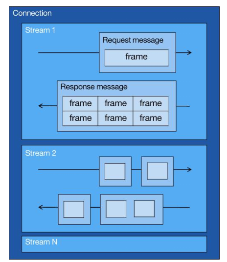

    **针对不同的HTTP请求用专门的Stream ID来区分，接收端通过Stream ID有序组装成HTTP消息，不同Stream的帧是可以乱序发送的，因此可以并发不同的Stream，也就是HTTP/2可以交错发送请求和响应**，如图例：

    

  - 服务器主动推送资源

    - 客户端和服务器双方都可以建立Stream，Stream ID也是有区别的，客户端的Stream ID必须是奇数号，服务器端必须是偶数号

      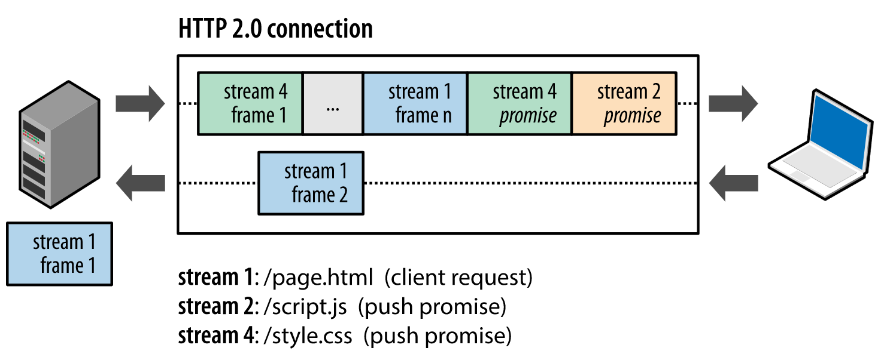

      HTTP/1.1 VS HTTP/2 **主动推送css文件，不需要再次请求**

      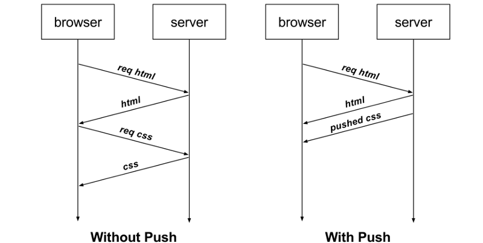

- #### HTTP/2缺陷

  - 还可能存在队头阻塞问题，**只不过在TCP层**

    HTTP/2是基于TCP协议传输的，TCP是字节流协议，TCP层必须保证收到的数据是完整且连续的，这样内核才会将缓存区内的数据返回给HTTP应用。

    

    **Packet3丢失，4-6只能等Packet3重传之后，才能被应用层读取**

    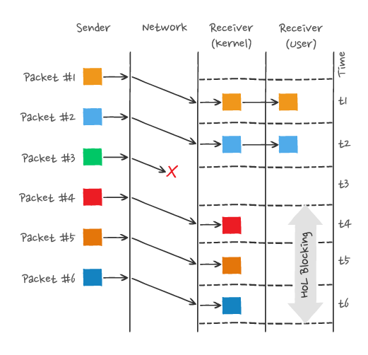

- ### **HTTP/3做了什么优化**

  - HTTP/2队头阻塞是因为下层是TCP协议，HTTP/3将TCP协议改成了UDP协议

  

  - UDP + QUIC协议， 可以实现类似TCP的可靠传输

    - QUIC协议特点

      - 无队头阻塞

        **当某个留发生丢失时，只会阻塞当前流**

        

      - 更快建立连接

        

      - 连接迁移

## HTTP/1.1如何优化？

- 尽量避免发送HTTP请求
  - 缓存
- 在需要发送HTTP请求时，考虑如何减少请求次数
  - 减少重定向请求次数
  - 合并请求
  - 延迟发送请求
- 减少服务器的HTTP响应的数据大小
  - 无损压缩
  - 有损压缩

- ### 减少重定向请求次数

  - **将重定向的工作交给代理服务器完成**

    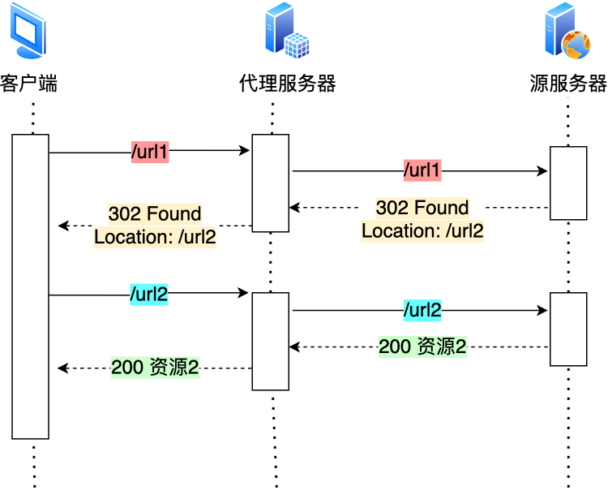

    ### **变成**

    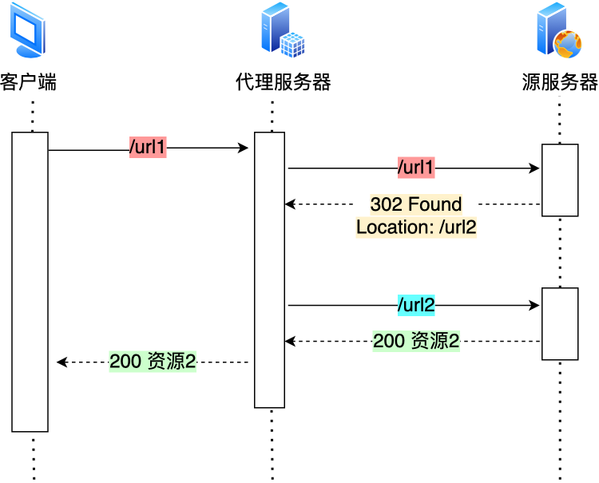

    ##### **若代理服务器知道重定向规则**

    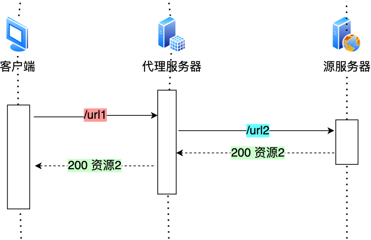

- ### 合并请求

  **以一个大资源的请求替换多个小资源的请求**

  但是，当一个小资源发生变化时，就要重新下载整个完整的大资源文件

- ### 延迟发送请求

  - 不需要的先不加载，比如，**当用户下拉页面时，再向服务器获取接下来的资源**

## 如何减少HTTP响应的数据大小？

- 有损压缩，**针对音频视频图片**
- 无损压缩

## HTTPS握手过程

- ### TLS握手

  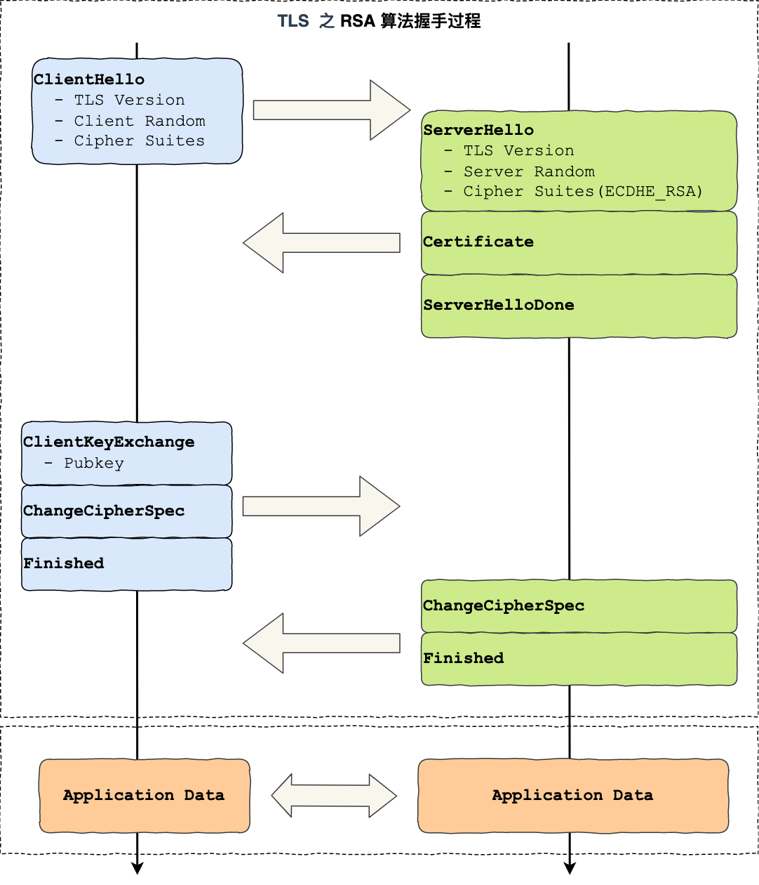

  **传统的TLS握手基本都是使用RSA算法来实现的**

- ### TLS第一次握手Client Hello

  - 客户端TLS版本

  - 随机数Client Random

  - 接受的加密方式，例如RSA

    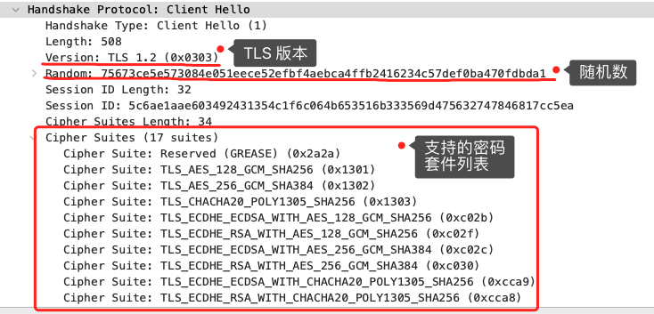

- ### TLS第二次握手Server Hello

  - 服务器端的TLS版本

  - 随机数Server Random

  - 加密方式

    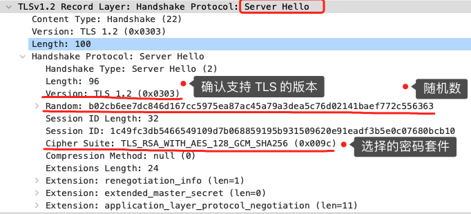

​		**可以看到，服务端选择的密码套件是**

```text
Cipher Suite: TLS_RSA_WITH_AES_128_GCM_SHA256
```

​	**密钥交换算法 + 签名算法 + 对称加密算法 + 摘要算法**

- WITH前面两个单词，**分别为约定密钥交换算法**，**约定证书验证算法**
- 握手后使用AES对称算法，密钥长度128位，分组模式是GCM
- 摘要算法SHA256用于消息认证和产生随机数

### **至此，双方确认使用的TLS版本号和使用的密码套件，互相传递了随机数**

发送Server Certificate，包含数字证书

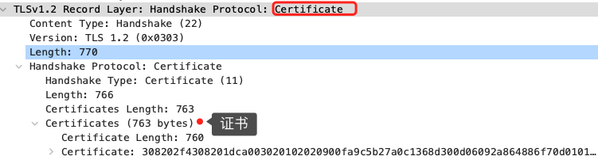

发送Server Hello Done

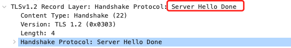

## 思考：数字证书怎么验证？

- 数字证书包含什么？

  - 公钥
  - 持有者信息
  - 证书认证机构的信息（CA）
  - CA对这份文件的签名和算法
  - 证书有效期
  - 其他信息

- 验证流程

  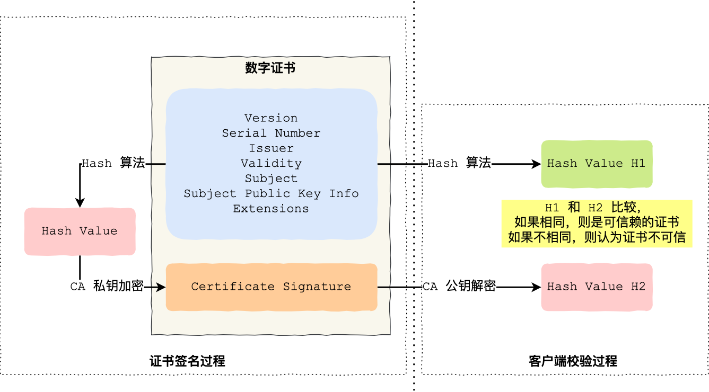

- ### TLS第三次握手

  - 客户端生成新的随机数pre-master

    **至此，客户端双方都共享了三个数据，分别是Client Random、Server Random、pre-master**

  - 根据三个随机数，生成会话密钥（Master Secret）

  - 客户端发送「Change Cipher Spec」

    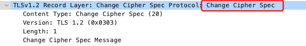

  - 客户端发送「Encrypted Handshake Message（Finished）」，将之前数据作摘要，再用会话密钥加密，让服务器做验证，看加密通信是否可用，之前握手信息是否被修改过

    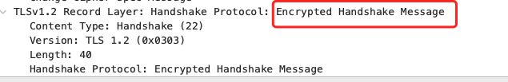

- ### TLS第四次握手

  - 服务器发送「Change Cipher Spec」
  - 服务器发送「Encrypted Handshake Message」

**RSA密钥协商不支持前向加密**

客户端传递随机数，使用公钥加密的，服务器用私钥解密得到随机数。一旦服务器私钥泄漏，过去第三方截获的所有TLS通讯密文都会被破解。

## HTTPS ECDHE握手分析

- DH->ECDHE
  - 非对称加密算法

## HTTPS性能优化

- ### 分析性能损耗

  - 第一个环节：TLS握手
  - 第二个环节：握手后的加密报文传输

**主要针对TLS握手过程的优化**

- 硬件优化：**HTTPS是计算密集型，而不是I/O密集型**————好的CPU
- 软件优化：
  - 软件升级
  - 协议优化

- 协议优化
  - 密钥交换算法优化
    - RSA算法->ECDHE算法

- TCP篇

  - 基本格式

    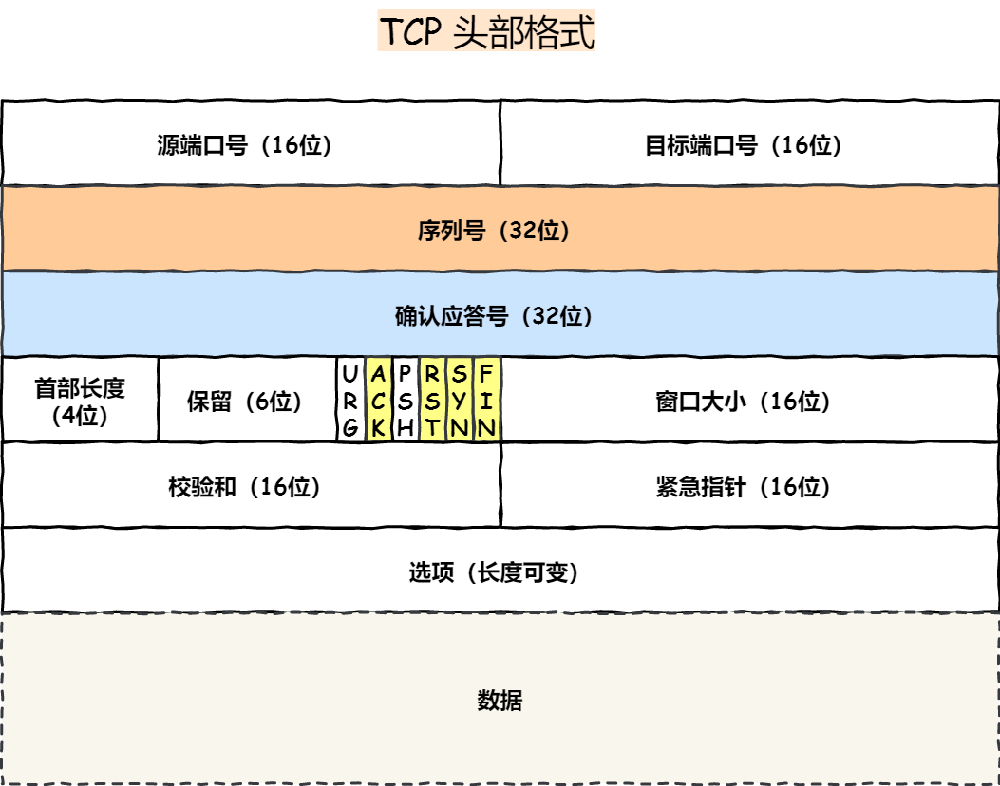

    - 序列号
      - 在建立过程中计算机生成的随机数作为初始值，通过SYN包传给接收端主机，每发送一次数据，就累加一次，**用于解决网络包乱序的问题**
    - 确认应答号
      - 指下一次期望收到的数据的序列号，发送端收到这个确认应答之后可以认为这个序号之前的数据都以被正常接收，**用来解决丢包问题**
    - 控制位
      - ACK 该位为1时，确认应答的字段变为有效。TCP规定除了最初建立连接时的SYN包之外该位必须设置为1
      - RST 该位为1时，表示TCP连接出现异常，必须强制断开连接
      - SYN 该位为1时，希望建立连接，并在其序列号的字段进行序列号初始值的设定
      - FIN 该位为1时，表示今后不会再有数据发送，希望断开连接。通信双方主机就可以交换FIN位为1的TCP段。

- 为什么需要TCP？
  - IP不可靠。**不保证网络包的交付，不保证网络包的按序交付，不保证网络包的数据完整性**

- TCP是什么？
  - **面向连接的、可靠的、基于字节流的传输层通信协议**
    - 面向连接 一对一连接，不可以像UDP一样一对多
    - 可靠的 无论网络链路层出现了怎样的变化，TCP都可以保证一个报文一定能到达接收端
    - 字节流 消息会被操作系统分组，多个TCP报文，且TCP报文是有序的，即使先收到了后面的报文，也不能交付应用层处理，需等待前面报文到达一并交付

- 什么是TCP连接？

  - 三个共识

    - Socket IP + 端口号
    - 序列号 解决乱序问题
    - 窗口大小 流量控制

  - 确定唯一连接

    - 源地址

    - 源端口

    - 目标地址

    - 目标端口

      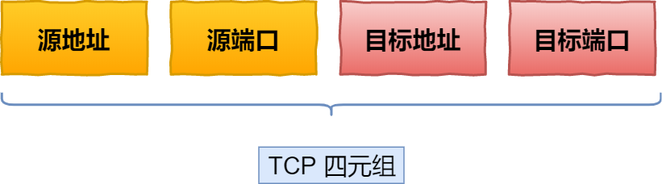

- TCP和UDP有什么区别？分别应用场景？

  - UDP不提供复杂的控制协议，利用IP面向无连接的通信服务

    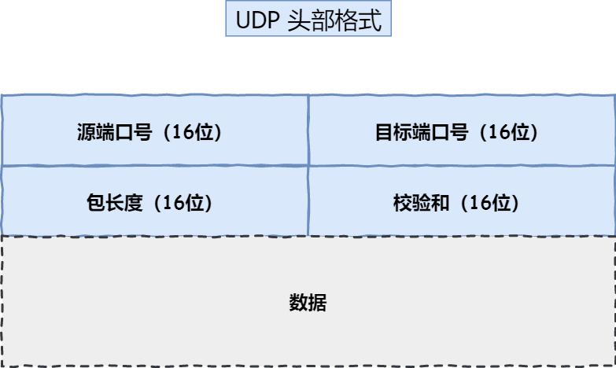

    - 目标端口和源端口：应该发给那个应用进程
    - 包长度：UDP首部长度 + 数据长度
    - 校验和：为了提供可靠的UDP首部和数据而设计，防止收到受损包

  - 区别？

    - 连接
      - TCP面向连接，传输数据之前需建立连接
      - UDP不需要建立连接，即刻传输数据
    - 服务对象
      - TCP是一对一的两点服务
      - UDP支持一对一，一对多，多对多
    - 可靠性
      - TCP是可靠交付数据的，数据可以无差错，不丢失，不重复，按序到达
      - UDP是尽最大努力交付，不保证可靠交付数据。但是可以利用UDP传输协议实现一个可靠传输协议，例如QUIC协议
    - 拥塞控制，流量控制
      - TCP有拥塞控制，流量控制
      - UDP没有，即使网络拥堵，也不会影响UDP的发送速率
    - 首部开销
      - TCP首部较长
      - UDP首部较短，开销小
    - 传输方式
      - TCP是流式传输，没有边界，但保证数据顺序和可靠
      - UDP有边界，会出现乱序和丢包
    - 分片
      - TCP若大于MSS大小，会分片。在传输层分片，在传输层组装。如果中途丢失了一个分片，只需要重传丢失的这个分片
      - UDP的数据大小如果大于MTU大小，则会在IP层进行分片，在IP层组装，再传给传输层
    - 应用场景
      - TCP面向连接，可保证数据的可靠交付
        - FTP文件传输
        - HTTP/HTTPS
      - UDP面向无连接，随时发送数据，再加上UDP本身处理简单高效
        - 包总量较少的通信DNS，SNMP
        - 视频、音频
        - 广播